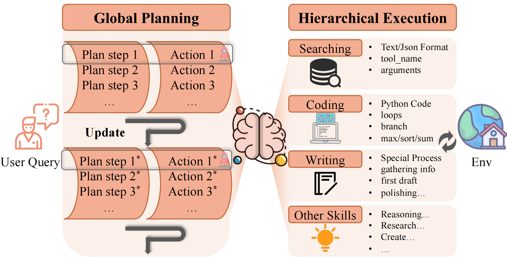

# Enhancing LLM-Based Agents via Global Planning and Hierarchical Execution (GoalAct)



## Intro
Intelligent agent systems based on Large Language Models (LLMs) have shown great promise in real-world applications. However, existing agent frameworks still face critical limitations in task planning and execution, restricting their effectiveness and generalizability. Specifically, current planning methods often lack clear global goals—leading agents to become stuck locally—or produce non-executable plans. Meanwhile, existing execution mechanisms struggle to balance complexity and stability, and their limited action space restricts their ability to handle diverse real-world tasks. To address these limitations, we propose GoalAct, a novel agent framework that introduces a continuously updated **global planning** mechanism and integrates a **hierarchical execution** strategy. GoalAct decomposes task execution into high-level skills, including searching, coding, writing and more, thereby reducing planning complexity while enhancing the agents' adaptability across diverse task scenarios. We evaluate GoalAct on LegalAgentBench, a benchmark that has no risk of data leakage and requires external legal knowledge for task completion. Experimental results demonstrate that GoalAct achieves state-of-the-art (SOTA) performance, with an average improvement of 12.22% in success rate. These findings highlight GoalAct’s potential to drive the development of more advanced intelligent agent systems, making them more effective across complex real-world applications.

## Run
```bash
conda env create -f environment.yml
python GoalAct.py --model {model_name} --date {experiment_date} [--multi]
```
- model: Specifies the LLM for the Agent.
- date: Records the experiment time.
- multi: Indicates whether multiprocessing is enabled.

## Structure
- result
  - output: Results of the main experiment
  - output_a1: Ablation experiment (w/o global plan)
  - output_a2: Ablation experiment (w/o searching)
  - output_a3: Ablation experiment (w/o coding)
  - output_a4: Ablation experiment (w/o writing)

- GoalAct.py: Project entry point
- act.py: The run component of the agent (global planning)
- action.py: The agent’s hierarchical execution
- prompt.py: Prompts for various agent modules
- LLM.py: Defines the interface for the LLM (bash url & api key)
- memory.json: Few-shot examples for global planning
- memory.py: Memory management for the agent
- api.py & generated_tools.py: The agent's toolset
- schema.py: Data table schema of the external environment
- utils.py: Other utility modules
